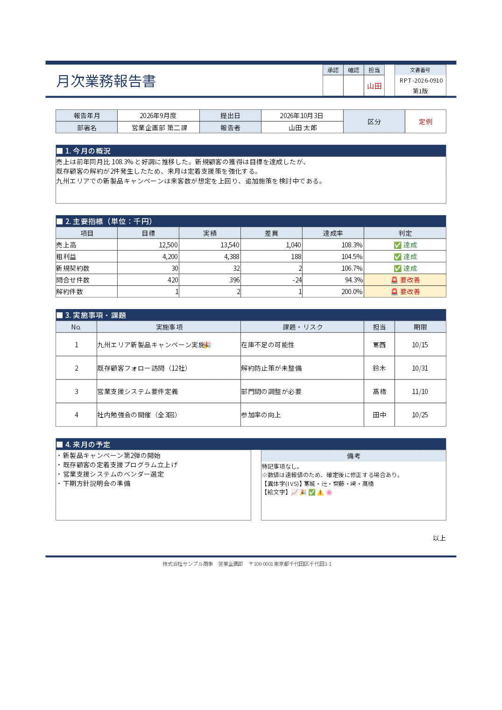

# ExcelRenderer

> PDF 出力では通常文字を検索可能なテキストとして維持しますが、対応する漢字 IVS は format 14 で選択された字形を保持するためベクター輪郭として出力します。輪郭化された IVS 部分はテキストとして検索・コピーできません。

[English](README.md) | 日本語

## 概要

Excel ワークブックを読み込み、レイアウト計算を経て PDF またはページごとの PNG・SVG を生成する .NET ライブラリです。

Excel を直接 PDF へ描画するのではなく、次の中間モデルを段階的に生成します。

```text
Excel (.xlsx)
    ↓
ReportDocument
    ↓
RenderDocument
    ↓
DrawCommand
    ↓
PDF / PNG / SVG
```

読み込み、レイアウト計算、描画命令生成、出力を分離することで、処理内容を理解しやすくし、将来的な機能追加や出力先の追加を行いやすい構成にしています。

現在は MVP 段階です。ライブラリに加えて、PDF・PNG・SVG・Markdownへ変換するコマンドラインツールを提供します。

### 主な機能

- ClosedXML による `.xlsx` の読み込み
- セル文字列、フォント、文字サイズ、配置、折り返しの読み込み
- 結合セル、列幅、行高の読み込み
- 非表示行・非表示列の除外
- 印刷領域、用紙サイズ、向き、余白、拡大縮小設定の読み込み
- 背景色、罫線、セル文字列の描画
- 行・列境界を基準としたページ分割
- PNG、JPEG などのワークシート画像の描画
- ヘッダー、フッター文字列の描画
- 印刷範囲に依存しないシート座標での図形・画像のアンカー解決（回転後の外接矩形によるページ判定・自動使用範囲・連続キャンバス寸法、反復タイトル領域を除いた本文クリップ）。非表示行列とアンカーの相互作用は Excel 実機で未検証です
- PDFsharp による PDF 出力
- SkiaSharp によるページごとの PNG 出力と画像のデコード

## インストール

ライブラリ、任意のフォント、コマンドラインツールは別々の NuGet パッケージです。NuGet.org に公開された後、以下のコマンドでインストールできます。CLI はライブラリとフォントパッケージを依存関係としてインストールします。

### ライブラリ（NuGet）

.NET Standard 2.1 と互換性のあるアプリケーションのプロジェクトディレクトリで実行します。

```bash
dotnet add package ExcelRenderer
dotnet add package ExcelRenderer.Fonts  # 日本語フォントが必要な場合
```

`ExcelRenderer` はアプリケーション側でフォントを用意する場合、単独で使用できます。
`ExcelRenderer.Fonts` は通常描画用 Noto Sans JP Regular TTF、IVS 用 IPAmj 明朝、Noto Color Emoji の
フォントリソースだけを追加する任意パッケージであり、ライブラリ API の利用には
必須ではありません。フォントを再配布する場合は、それぞれのライセンスに従って
ください。詳細は[サードパーティ通知](THIRD-PARTY-NOTICES.md)を参照してください。

### コマンドラインツール（dotnet tool）

.NET 10 SDK をインストールし、NuGet.org からツールを取得します。

```bash
dotnet tool install --global ExcelRenderer.Tool
excelrenderer --help
```

パッケージ名は `ExcelRenderer.Tool`、実行コマンド名は `excelrenderer` です。CLI は
`ExcelRenderer` と `ExcelRenderer.Fonts` に依存するため、これらを個別にインストールする
必要はありません。これらのコマンドは、NuGet のパッケージソースで NuGet.org が有効に
なっていることを前提とします。

既にグローバルインストールしている場合は、次のコマンドで更新します。

```bash
dotnet tool update --global ExcelRenderer.Tool
```

プロジェクト単位で管理する場合は、利用するリポジトリでローカルインストールします。`dotnet new tool-manifest` は、既存のマニフェストがない場合だけ実行してください。

```bash
dotnet new tool-manifest
dotnet tool install --local ExcelRenderer.Tool
dotnet tool run excelrenderer --help
```

`.config/dotnet-tools.json` をコミットすると、他の開発者は `dotnet tool restore` で同じバージョンをインストールできます。

## クイックスタート

CLI で PDF・画像・SVG・Markdown に変換します。

```bash
excelrenderer pdf input.xlsx -o output.pdf
excelrenderer image input.xlsx -o ./images
excelrenderer svg input.xlsx -o ./svg-output
excelrenderer md input.xlsx -o output.md
```

C# から呼び出す場合は、ライブラリを追加して次の 1 行で変換できます。

```csharp
await ExcelConverter.ConvertToPdfAsync("input.xlsx", "output.pdf");
```

出力例:



詳しくは [CLI の使い方](#cli-の使い方)、[C# API（高レベル）](#c-api高レベル)、[C# API（低レベル）](#c-api低レベル)を参照してください。

## CLI の使い方

### 基本構文とコマンド

基本構文は次のとおりです。`input.xlsx` は位置引数で、必須の `--output` は `-o` と省略できます。

```text
excelrenderer <command> <input.xlsx> --output <path> [options]
```

| コマンド | 出力 | コマンド固有の主なオプション |
| --- | --- | --- |
| `pdf` | 1 個の PDF | `--sheet <シート名>` |
| `image` | 印刷ページごとの PNG | `--sheet <シート名>`、`--dpi <数値>`（既定値 `144`） |
| `svg` | 印刷ページごとの自己完結 SVG | `--sheet <シート名>` |
| `markdown` / `md` | 1 個の Markdown と任意の抽出画像 | `--sheet`、`--image-dir`、`--[no-]images`、`--[no-]cell-addresses`、`--[no-]formulas`、`--[no-]layout-detection`、`--[no-]region-detection` |
| `render` | PDF ファイル、または PNG/SVG/Markdown の出力ディレクトリ | `--format pdf\|png\|svg\|markdown` と選択、レイアウト、診断、マニフェスト、フォント方針の各オプション |

### フォント指定

すべてのコマンドで次のフォント指定を使用できます。

| オプション | 説明 |
| --- | --- |
| `--font-dir <ディレクトリ>` | 追加ディレクトリを再帰的に検索します。複数回指定、または 1 回に複数の値を指定できます。 |
| `--font-file <ファイル>` | フォントファイルを直接登録します。複数指定時はコマンド行の順に使用します。.ttf、.tte、.otf の TrueType/OpenType 内容を使用できます。 |
| `--fallback-font <ファミリー名>` | 既定のフォールバック一覧を、指定順のファミリーで置き換えます。複数回指定して優先順を作れます。 |
| `--no-system-fonts` | OS のフォントディレクトリを検索しません。明示ファイル、追加ディレクトリ、CLI 同梱フォントは引き続き使用できます。 |
| `--font-policy bundled\|requested` | 同梱の互換フォント（既定）と、要求・明示指定したフォントのどちらを優先するか選びます。 |
| `--ivs-font-style gothic\|mincho` | IVS に使用する同梱フォントの書体を選びます（既定値 `gothic`）。 |

これらは PDF、PNG、SVG の字形選択に影響します。Markdown は字形を描画しませんが、共通のフォント引数を持つスクリプトでコマンドを切り替えられるよう同じ指定を受け付けます。空白を含むパスは引用符で囲んでください。コンテナーで再現可能な出力にする例:

```bash
excelrenderer pdf report.xlsx -o report.pdf \
  --font-dir /app/fonts \
  --font-file /app/company-fonts/ReportSans.ttf \
  --fallback-font "Noto Sans JP" \
  --fallback-font "Liberation Sans" \
  --no-system-fonts
```

コマンド一覧は `excelrenderer --help`、各コマンドの完全なオプション一覧は `excelrenderer <command> --help` で確認できます。

上記のフォント指定はすべてのコマンドで使用できます。
`--font-file` はファイルを直接読み、内部のファミリー名と書体を登録します。このため、
拡張子ではなく内容が SkiaSharp で有効な TrueType/OpenType であれば `.ttf`、Windows EUDC の
`.tte`、`.otf` を同じ入口から指定できます。例:
`--font-file /app/fonts/report.ttf --font-file "C:\Windows\Fonts\EUDC.TTE"`。
BMP 私用領域 (U+E000–U+F8FF) は要求フォント、指定ファイル（コマンド行の順）、通常の
フォールバックの順に調べます。どのフォントにも字形がなければ `MissingPrivateUseGlyph` を
報告して U+FFFD を描画し、`--strict` または `--warnings-as-errors MissingPrivateUseGlyph` で
変換を失敗させられます。ファイルは読取可能かつ有効でなければならず、ライセンスと PDF
埋め込み条件の確認は利用者の責任です。Markdown は字形を描画しないため、この指定の影響を
受けません。既定の
`bundled` は既存出力との互換性のため同梱フォントを優先し、`requested` は指定フォントと
追加ディレクトリを設定済みフォールバックおよび同梱フォントより先に検索します。フォール
バックは Unicode テキスト要素単位で決定するため、サロゲートペアと結合文字列は分断しません。

### 連続画像として出力する

統合 `render` コマンドでは、選択した各シートを印刷ページの余白・改ページ・タイトル・ヘッダーなしの連続画像として出力できます。

```bash
excelrenderer render input.xlsx -o ./continuous-images --format svg --image-layout continuous
```

連続レイアウトは PNG と SVG のみで、`--pages` とは併用できません。明示範囲がなければ印刷範囲ではなくシートの使用範囲を使います。PNG の連続出力は、RGBA bitmap とエンコード時の追加メモリを安全に抑えるため、既定で 1 億ピクセル（bitmap 本体で約 381 MiB）の上限を適用します。より大きいキャンバスが必要な場合も、`RenderRequest.MaxPngPixels` には安全な有限値を指定してください。

### 明示範囲・余白切り詰め・セルリンク

範囲指定と余白切り詰めには統合 `render` を使用します。

```bash
excelrenderer render input.xlsx -o report.pdf --format pdf \
  --sheet "売上 2026" --range "'売上 2026'!B2:F40" \
  --trim --trim-padding 2 --hyperlinks preserve --manifest report.json
excelrenderer render input.xlsx -o images --format png \
  --sheet Sheet1 --range B2:F40 --image-layout continuous --trim
excelrenderer render input.xlsx -o svg --format svg --sheet Sheet1 --range B2:F40 --trim
excelrenderer render input.xlsx -o markdown --format markdown --hyperlinks preserve
```

| オプション | 動作 |
|---|---|
| `--range` | 選択シートごとに1矩形。繰返し可。A1単一セル／順方向矩形、`$`、英字小文字を受け付けます。空白を含むシート名は単一引用符、名前内の引用符は `''`。シート省略は選択シートが1つの場合だけ可能です。 |
| `--max-range-cells` | 明示範囲の総セル数上限。正の整数、既定100万。空セルも数えます。処理量の制限でありメモリ保証ではありません。 |
| `--trim` | 通常の改ページ後、各ページ／連続キャンバスの描画内容の外周を切り詰めます。再配置・再倍率計算をしません。 |
| `--trim-padding` | 四辺のpt余白。非負有限値、既定2。`--trim` が必要です。 |
| `--hyperlinks preserve\|none` | 既定 `preserve`。旧 `pdf` と `markdown`／`md` でも使用可能。`none` は表示・書式を保ち、リンク診断・追加アンカー・リンク一覧を出しません。 |

明示範囲はシートの既存印刷範囲を置き換え、用紙・余白・倍率・ページ順を維持します。印刷タイトルは指定範囲との交差部分だけ反復します。範囲でシートを暗黙選択しません。全行／全列、union、名前、逆順、外部／3D参照は引数エラーです。連続画像では指定矩形を使い、範囲外オブジェクトで自動拡張しません。部分結合セルは元の幅で文字を計測し、整列・罫線・位置を保ってclipし、`ClippedMergedCell` Warningを記録します。`--pages` は範囲適用後・trim前の文書通番です。全非表示範囲も空ページ／キャンバスを維持します。

trimの対象は可視の塗り（明示白塗りも含む）、線、配置済み文字、画像、図形、ヘッダー／フッターです。取得可能な文字は字形境界を使い、絵文字・互換字形は確定配置の安全側の論理境界を使います。画像内の白／透明領域をピクセル解析して除去する処理ではありません。空のtrim結果は1×1ptに四辺paddingを加え（既定5×5pt）、`EmptyContent` Infoを記録します。PNGは最終pt寸法からceilでpx寸法を求め、ページ／連続の双方でbitmap確保前に `RenderRequest.MaxPngPixels` を適用します。

PDF／Markdownは `http`、`https`、`mailto` と同一ブックのセルリンクを保持します。範囲ref、空セル、単純A1を参照するスコープ付き名前、定数文字列引数の `HYPERLINK` に対応します。XMLの明示定義を数式より優先し、cached表示を保持します。対応数式でcached値がなければliteralの表示名／リンク先を表示し、一般的な数式再計算は行いません。PDF注釈は最終結合文書へ付け、ページ選択・範囲・trimを反映します。Markdownは安定した `xl-sN-rN-cN` アンカーと、空セル／範囲refを表す明示一覧を使います。PNG／SVGはセルの見た目を保持し、クリック機能やリンク警告を追加しません。SVGリンクやリンクsidecarは生成しません。

ローカルファイル、相対パス、UNC、HTTP埋込み認証情報、制御文字、非対応schemeや競合定義は表示文字を残して `HyperlinkRejected`、動的数式等は `HyperlinkUnsupported` Warningになります。未存在／出力外の内部リンク先は `HyperlinkTargetOmitted`。出力外のリンク元にはリンク先欠落警告を出しません。診断にURL・宛先・query全文を載せません。読込可能な不正リンク定義はWarningですが、ClosedXMLが拒否する破損ブックは致命的入力エラーです。Strict／指定したwarnings-as-errorsはSink Open前に失敗します。PDF CLIは事前検証後に初めて作成・truncateし、入力と出力の同一パスは読込前に拒否します。

APIでは `RenderRequest.Selection.Ranges` に `SheetRangeSelection`、`MaxRangeCells` に総上限、`RenderRequest.Trim` に `TrimOptions`、`Hyperlinks` に `HyperlinkMode` を指定します。

```csharp
var request = new RenderRequest
{
    OutputFormat = OutputFormat.Pdf,
    Selection = new SelectionOptions
    {
        SheetNames = new[] { "Sheet1" },
        Ranges = new[] { new SheetRangeSelection("Sheet1", new CellRange(new(2, 2), new(40, 6))) },
        MaxRangeCells = 1_000_000,
    },
    Trim = new TrimOptions { Enabled = true, PaddingPoints = 2 },
    Hyperlinks = HyperlinkMode.Preserve,
};
```

設定には `ExcelRenderer.Rendering` と `ExcelRenderer.Model` をimportします。旧PDF／Markdown設定にも `Hyperlinks` があります。Markdownの範囲・trim・ページ選択は出力前に拒否します。範囲／trimなしでは従来のページ寸法と配置を維持します。manifestはSchemaVersion=1にページ・範囲・crop情報を任意項目として追加します。幅・高さは最終寸法、元寸法とcrop座標はtrim前ページを表します。範囲省略は従来の印刷／使用範囲、crop／padding省略は恒等変換です。リンク先やtooltip全文をmanifestに列挙しません。

## C# API（高レベル）

PDF出力では、Skiaがcodecを生成できない画像やbitmapへデコードできない画像をスキップし、
`ImageDecodeFailed` の警告を報告します。診断にはシート名、元ページ番号、画像の位置・寸法、
バイト数、先頭最大16バイト、失敗理由が含まれます。`render` コマンドは警告を標準エラーに表示し、
`--manifest report.json` で詳細をJSONに保存できます。厳格モード、またはこの警告コードを
エラー扱いにした場合は変換を中止します。低レベルの `PdfSharpRenderer` では
`DiagnosticHandler` で警告を受け取れます。`System.Diagnostics.Trace` のリスナーにも出力します。

`ExcelConverter` が読み込み、レイアウト、描画、書き出しまでを行います。

```csharp
using ExcelRenderer;

await ExcelConverter.ConvertToPdfAsync("input.xlsx", "output.pdf");
await ExcelConverter.ConvertToImagesAsync("input.xlsx", "./images");
await ExcelConverter.ConvertToSvgAsync("input.xlsx", "./svg-output");
await ExcelConverter.ConvertToMarkdownAsync("input.xlsx", "output.md");
```

ストリーム連携には `RenderAsync` を使用できます。入力は現在位置から読み取り、入力
ストリームと `SingleStreamOutputSink` の出力ストリームは閉じません。ページごとの
PNG/SVG には `DirectoryOutputSink` を使用します。`RenderRequest` では完全一致の
シート名（指定順）と PDF/PNG/SVG の文書ページを選択できます。Markdown はページ
選択を受け付けません。`ConversionManifest.WriteAsync` は完了した成果物メタデータと

## C# API（低レベル）

ライブラリを参照し、`ExcelReader`、`ReportLayoutEngine`、`DrawCommandGeneratorPass`、`PdfSharpRenderer` の順に使用します。

```csharp
using ExcelRenderer.Drawing;
using ExcelRenderer.Excel;
using ExcelRenderer.Layout;
using ExcelRenderer.PdfSharp;

var document = new ExcelReader().Read("report.xlsx");
var layoutEngine = new ReportLayoutEngine(new PdfSharpTextMeasurer());
var commandGenerator = new DrawCommandGeneratorPass();
var renderer = new PdfSharpRenderer();
var sheet = document.Sheets[0];

var renderDocument = layoutEngine.Layout(sheet);
var commands = commandGenerator.Generate(renderDocument);

using var output = File.Create("report.pdf");
renderer.Render(commands, sheet.PageSettings, output);
```

`ExcelReader` は、xlsx が明示倍率とページ数への適合のどちらを使用するかを
`PageSettings.ScaleMode` に保持します。ページ数への適合では 100% を超えて拡大しません。
`PageSettings` を直接生成して `ScaleMode` を指定しない場合は、正の `Scale` を優先する従来の
規則を維持します。位置引数の既定倍率よりページ数指定を優先するには、モードを明示します。

```csharp
var settings = new PageSettings(FitToPagesWide: 1)
{
    ScaleMode = PrintScaleMode.FitToPages,
};
```

xlsx の個別列幅と既定列幅は、Excel の基準である固定96 DPIのraw値から変換します。PNGの出力DPIは
シートの幾何には影響しません。Normalスタイルのstyle XFからフォントをたどり、themeのmajor/minor
指定を解決したうえで、設定されたフォントマネージャーにより0～9を計測します。計測できない場合は
最大数字幅7pxを使用し、変換診断へ`MaximumDigitWidthFallback`を記録します。

離れた複数の印刷範囲は外接矩形へ結合せず、個別にページ化します。明示倍率では保存された行・列の
手動改ページとページ順を反映し、Fitでは手動改ページを無視します。全領域を結合したページ番号を一度だけ
連番化するため、ページフィールドとPDF/PNG/SVGのページ選択は同じ番号を使います。複数ページに交差する
オブジェクトは同じ元配置から各ページへ配置し、物理用紙だけでなく各ページの本文Viewportでクリップします。
保存された水平・垂直中央配置ではセル、オブジェクト、本文clipを同じ量だけ移動します。連続出力では印刷設定を
適用しません。セルのインデント、内容余白、通常回転、文字要素を積むTopToBottomはPDF、PNG、SVGへ引き継ぎます。

折り返しセル文字列はレイアウト段階で行と解決済みフォントrunへ確定し、書記素単位の強制分割と
明示改行の情報を保持します。確定結果を描画命令まで渡すため、PDF、PNG、SVGが個別に異なる位置で
再改行することはありません。各バックエンドは確定した実効フォントサイズ、行ごとのbaselineと高さ、
選択済みrunフォント、論理run X/advanceを使用し、描画時に折返し・縮小・送り位置を再決定しません。
`TextLayout`を持たずAPIから直接作成した描画命令には、従来のレンダラ側互換経路を維持します。
この互換経路のPNG/SVGでは、指定family・weight・slantからSkiaのシステムfaceを一度選択し、
計測、折返し、縮小、描画まで同じfaceを維持します。

`TextLayoutResult.EffectiveFontSize` は互換性のため状態を区別します。従来の2引数コンストラクターで
サイズを未指定にした結果は描画命令のstyleサイズを使い、明示的な0は描画を抑止します。PDFとSkiaは
確定runで選択された実faceをメモリフォントを含めて再利用します。確定経路の下線は保存済みの行原点・
baseline・幅から一度だけ手動描画し、PDFフォント自身の下線装飾は無効にします。

DrawingML画像ではoneCell、twoCell、absoluteアンカーをpoint単位で解決し、marker offset、extent、`editAs`、
source crop、回転、flip、描画順とともに保持します。source cropは描画先Boundsを変更せず、両方の
レンダラーバックエンドで適用します。

`ReportDocument` には複数シートを保持できます。PDF を作成する対象シートを呼び出し側で選択し、シートごとにレイアウトから描画までの処理を行ってください。

```csharp
foreach (var sheet in document.Sheets)
{
    var renderDocument = layoutEngine.Layout(sheet);
    var commands = commandGenerator.Generate(renderDocument);
    var fileName = $"{sheet.Name}.pdf";

    using var output = File.Create(fileName);
    renderer.Render(commands, sheet.PageSettings, output);
}
```

### PNG として出力する

PDF と同じレイアウトおよび描画コマンドを `PngRenderer` に渡します。次の例では `report-1.png`、`report-2.png` のようにページごとのファイルを作成します。出力ストリームは各ページの描画後にレンダラーが破棄します。

```csharp
using ExcelRenderer.SkiaSharp;

var pngRenderer = new PngRenderer();
pngRenderer.Render(
    commands,
    sheet.PageSettings,
    pageNumber => File.Create($"report-{pageNumber}.png"),
    dpi: 144);
```

1 ページだけを既存のストリームへ書き込む場合は `RenderPage` を使用します。この場合、渡したストリームはレンダラーが破棄しません。

```csharp
using var output = File.Create("report.png");
pngRenderer.RenderPage(
    commands.Where(command => command.PageNumber == 1),
    sheet.PageSettings,
    output);
```

### SVG として出力する

同じ描画コマンドから `report-1.svg`、`report-2.svg` のようにページごとのファイルを作成します。SVG の寸法と座標は PDF ポイントです。

```csharp
var svgRenderer = new SvgRenderer();
svgRenderer.Render(
    commands,
    sheet.PageSettings,
    pageNumber => File.Create($"report-{pageNumber}.svg"));
```

## フォント

PDF と PNG の変換では、任意の `ExcelRenderer.Fonts` パッケージが導入されていれば、
埋め込まれた Noto Sans JP Regular TTF、IVS 用の IPAmj 明朝、および Noto Color Emoji を使用できます。単体の絵文字と VS16 付き絵文字はカラーで描画し、PDF と SVG には画像として埋め込みます。ZWJ などの複合絵文字には別途シェーピングが必要です。未導入
の場合は登録済みまたは OS のフォントを解決します。PDFsharp で外部フォントを使う
場合は、PDFsharp がフォントを使用する前にフォントリゾルバーを設定してください。
指定するファミリー名は、Excel のセルに設定されたフォント名と一致させます。

任意の同梱フォントを読み込む際は、次のファイル名（`NotoSansJP-Regular.ttf`、
`ipamjm.ttf`、`NotoColorEmoji.ttf`）をこの順で検索します。

1. `ExcelRenderer.dll` と同じディレクトリにある `*.dll` 内の埋め込みリソース。
   リソース名はファイル名と完全一致するか、`.` とファイル名で終わる必要があります。
   DLL はパスの ordinal 順に確認し、読み込みまたは検査できない DLL はスキップします。
2. `ExcelRenderer.dll` の配置ディレクトリおよびそのサブディレクトリにある、
   ファイル名が完全一致する通常ファイル。複数見つかった場合はパスの ordinal 順で
   最初のファイルを使用します。

埋め込みリソースが見つかった場合は通常ファイルより優先します。DLL の検索は再帰せず、
サブディレクトリまで検索するのは通常ファイルだけです。

```csharp
using PdfSharp.Fonts;
using ExcelRenderer.PdfSharp;

GlobalFontSettings.FontResolver = new PdfSharpFontResolver(
    "Noto Sans JP",
    "/app/fonts/NotoSansJP-Regular.ttf");
```

フォントリゾルバーはアプリケーションドメインごとに一度だけ、PDFsharp がフォントを使用する処理より前に設定します。

## アーキテクチャ

Excel を `ReportDocument`、`RenderDocument`、`DrawCommand` の順に変換し、PDF・PNG・SVG へ描画します。

```text
Excel (.xlsx) → ReportDocument → RenderDocument → DrawCommand → PDF / PNG / SVG
```

レイアウト Pass、描画コマンド、レンダラー、拡張方法、ソースコード構成の詳細は [アーキテクチャ](docs/architecture.ja.md)を参照してください。

## 制約

- Excel の数式を完全には再現しません。
- Excel のグラフには対応していません。
- 条件付き書式を完全には再現しません。
- すべての用紙サイズには対応していません。
- ヘッダー、フッターのすべての書式指定には対応していません。
- ページ分割は行・列の境界で行い、結合セル、行、列の途中では分割しません。
- TopToBottomはUnicode文字要素を縦に積む方式です。本格的な縦組み字形選択と日本語禁則の完全一致は未対応です。
- 使用範囲・印刷範囲外でもxlsx XMLに明示された行列寸法をアンカー用シート座標へ反映し、非表示行列は0ptとして扱います。非表示行列とアンカーの挙動はExcel実機と未照合です。
- システムフォントを使用する場合は、実行環境にフォントをインストールする必要があります。
- Excel、PDF、PNG では文字列計測や描画方式が異なるため、完全に同一の見た目になることは保証しません。

## PDF の性能

ストリーム変換では、全ページを一つのPDF文書に直接描画し、最後に1回保存します。
nativeフォント、行メトリクス、PDFフォントを変換内で再利用し、nativeフォントは
成功・キャンセル・例外のいずれでも解放します。終了時には未使用のSkiaフォントstrikeも
解放します。文字キャッシュには件数上限があります。
シート座標、ページ候補、結合セル検索は索引を使い、同じ変換済み書式を共有します。
書式付き空セルは保持します。

converter は最初にページ band を計画し、元の文書順でページを選択します。
選択した全ページの寸法・trim・リンク・診断ポリシーを出力 sink の Open 前に確認し、
その後は1ページずつ生成・出力します。ページ別出力は事前確認と本描画の2周です。
公開 `ReportLayoutEngine.Layout` は materialize する互換 API のままです。
連続 PNG/SVG は描画層ごとにセルを再走査し、背景・罫線・文字・オブジェクトの順序を
保ちながら全命令の保持を避けます。Markdown は既存経路を維持します。

選択外シートの本文モデルと描画範囲外のモデルを削減します。
OS・追加ディレクトリのフォント走査では metadata のみを保持し、物理 face が初めて
選択された時に bytes と SHA256 の識別子を1回読み込みます。
明示 FontFiles・Registrations は即時に検証・snapshot し、任意 font pack のデータは
必要時に読み込みます。OS フォントは初回選択前には完全な snapshot ではなく、
読み込み前に消失・変更したファイルは明確な font load エラーになります。
PDFsharp のプロセス寿命の resolved font bytes cache は維持します。

PDFsharp の最終文書・リソースと、ClosedXML の全ブック読込は残ります。
幾何索引と選択モデルもブックの大きさに依存するため、定メモリのストリーミングではありません。
[フェーズ3測定](docs/phase3-performance.ja.md)、過去の[PDF測定](docs/pdf-performance.ja.md)と
[画像測定](docs/image-performance.ja.md)を参照してください。

## PNG・SVG の性能と buffer 設定

PNG は既存 bitmap の画素を直接エンコードします。ページ別出力は現在ページの bitmap 1枚、
連続 PNG は1シート＝1PNG・単一 bitmap のままであり、scanline・タイル分割ではありません。
RGBA の画素だけで概ね `4 × 幅 × 高さ` bytes に加え、alignment・encoder overhead が必要です。
直接 API も寸法・pixel limit を検証します。変換単位の画像 cache は decoded resource の
推定量に対する64MiBの LRU 上限を持ち、単独で上限超過する画像は現在の描画中だけ所有します。
PDFsharp が文書内で保持する画像リソースは、この推定上限とは別に残ります。

SVG は Skia SVG canvas と XML のストリーム正規化を維持し、文字のパス・埋込画像・
pt 寸法・viewBox を保持します。seekable 中間 buffer はメモリ capacity が閾値を超える前に
一時ファイルへ移します。Skia 内部の native SVG buffer は残るため、閾値は変換全体の上限ではありません。

`RenderRequest.Buffering`、`SvgExportOptions.Buffering`、および
`SvgRenderer.Render`・`RenderPage`・`RenderCanvas` の overload で `RenderBufferOptions` を指定します。

| 設定 | 既定 | 意味 |
|---|---|---|
| `MemoryThresholdBytes` | 8,388,608 | 中間 buffer のメモリ capacity 上限。単位は bytes。 |
| `AllowTemporaryFiles` | `true` | 閾値超過時に一度だけ spill。false 時は超過を拒否。 |
| `TemporaryDirectory` | `null` | OS 既定 temp、または指定した既存ディレクトリ。 |

CLI の `render`・`svg` に `--buffer-memory-threshold`（bytes）、
`--no-buffer-temp`、`--buffer-temp-directory` を追加しています。

```bash
excelrenderer render input.xlsx -o ./svg --format svg --buffer-memory-threshold 8388608
excelrenderer svg input.xlsx -o ./svg --buffer-memory-threshold 1048576 --buffer-temp-directory ./existing-temp
```

PDF/PNG でも設定を渡せますが、適用先は SVG 中間 stream だけです。
入力用 `WorkbookInputOptions` とは独立しており、入力側も自身の閾値・許可設定に従って
seekable な一時ファイルへ spool します。reader は独立した cursor を使い、spool を byte[] へ戻しません。
成功・キャンセル・失敗時に一時 buffer を cleanup し、caller 所有の入力・出力 stream は閉じません。
重い単一 native 描画・encode・ClosedXML 読込は即時に中断できない制約が残ります。

## 開発

必要な SDK は .NET 10 です。テストはリポジトリのルートで実行します。

```bash
dotnet test ExcelRenderer.slnx
```

ソースコードは `src/ExcelRenderer`、テストコードは `tests/ExcelRenderer.Tests` にあります。

詳細な設計資料は [アーキテクチャ](docs/architecture.ja.md)、[English](README.md) も参照してください。

## ライセンス

ExcelRenderer は [MIT License](LICENSE) で提供されます。

日本語フォントと Noto Color Emoji は任意の `ExcelRenderer.Fonts` パッケージに収録されます。ライブラリで使用する場合は `dotnet add package ExcelRenderer.Fonts` を追加してください。未導入の場合は登録済みまたはシステムのフォントを使います。CLI はフォントパッケージに依存します。Noto Sans JP と Noto Color Emoji には SIL Open Font License 1.1、IPAmj 明朝には IPA Font License Agreement v1.0 が適用されます。`FontOptions.ReplaceIvsWithBaseCharacter` を `true` にすると、IVS を異体字セレクターのない基底文字に置換して描画できます。詳細は[サードパーティ通知](THIRD-PARTY-NOTICES.md)を参照してください。

PDF 出力に使用した確定フォントは、PDFsharp のグローバル resolver の寿命に合わせてスナップショットをプロセス寿命でキャッシュします。折返し計測時のフォントファイル読込みとハッシュの反復を避けるためであり、アプリケーションでは有限で安定したフォント face 群を使用してください。

ソース参照専用の別プロジェクトは[ExcelRenderer Slim](https://github.com/akrym1582/ExcelRenderer/blob/main/docs/slim.ja.md)を参照してください（NuGet未公開）。


## Excelテンプレートへのマッピング

`ExcelRenderer.Mapping` は、C#オブジェクトまたはJSONをExcelテンプレートへ
マッピングする独立した .NET Standard 2.1 パッケージです。描画・フォントパッケージには
依存しません。`**` で始まるセルのパス、1行の配列展開、専用マーカー行
`**@start-array` / `**@end-array` による複数行・入れ子の展開、C#の書式指定、
手動改ページに対応します。

```sh
excelrenderer xlsx template.xlsx --data data.json -o report.xlsx
excelrenderer pdf template.xlsx --data data.json -o report.pdf
excelrenderer render template.xlsx --data data.json --format png -o ./png-output
```

`xlsx` はマッピング済みExcelを保存します。既存の描画コマンドには任意の `--data` を追加しました。
`**@page-break` は指定セルの上と左に改ページを入れ、該当シートを倍率指定へ切り替えます。
日時文字列は `date("yyyy/MM/dd")` 指定時だけ変換し、書式適用後の値は文字列になります。
空配列は対象行・ブロックを削除し、パス不存在は元セル位置付きのエラー、nullは空セルになります。

API例・構文・Excel機能の対応範囲は[マッピングガイド](docs/mapping.md)を参照してください。
